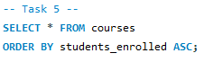
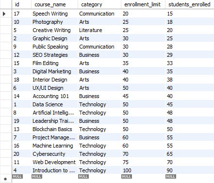

# Final Lab Task 3-1

## Task 1
### Retrieve all courses where students_enrolled is less than the enrollment_limit.
- Code

- Table Structure
  

## Task 2
### Group courses by category and calculate the total number of students enrolled. for each category.
- Code

- Table Structure

 
## Task 3
### Retrieve the courses that are fully enrolled (i.e., students_enrolled equals enrollment_limit).
- Code

- Table Structure

## Task 4
### Calculate the total number of students enrolled across all courses.
- Code

- Table Structure

## Task 5
### Sort courses by students_enrolled in ascending order.
- Code

- Table Structure

